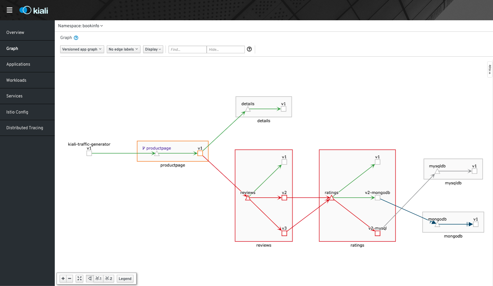
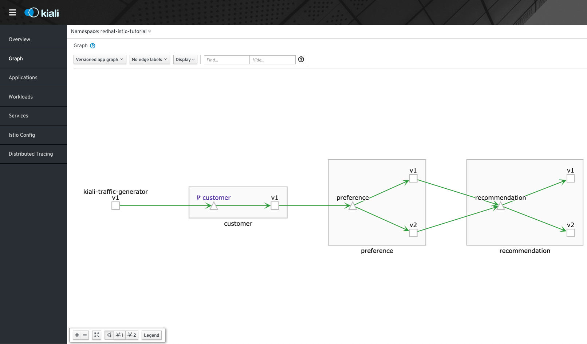

= Kiali Test Mesh Operator

Kiali Test Mesh provides an operator which will install different types of examples mesh which allow you to see different features of kiali.

It needs Istio to be installed. It is recommended to be used the link:https://github.com/Maistra/istio-operator#maistra-istio-operator][Maistra Operator] to install it.

In order to deploy the Operator you can use following make target (on root folder of this repository)

[source,shell]
----
make deploy-operator
----

After installing the operator you can install the custom resource for each type of mesh that might want to try.

Meshes available:

- link:https://preliminary.istio.io/docs/examples/bookinfo/[Bookinfo]
- link:https://github.com/redhat-developer-demos/istio-tutorial[Red Hat Istio Tutorial Microservices]
- Kiali Complex Mesh

== Bookinfo

link:https://preliminary.istio.io/docs/examples/bookinfo/[Bookinfo] is the "Hello World" example of Istio Resources.

After installing the <<Kiali Test Mesh Operator>>. Run the following command to deploy bookinfo mesh:

[source,shell]
----
make deploy-bookinfo
----

available options:

- `BOOKINFO_NAMESPACE` can be set to deploy namespace (default: `bookinfo`)

[NOTE]
Automatic Injection is supported way to inject with multi-tenancy.

- `MANUAL_INJECTION_SIDECAR` can be set to true or false (default: `false`, which means it will use link:https://preliminary.istio.io/docs/setup/kubernetes/additional-setup/sidecar-injection#automatic-sidecar-injection[automatic injection of the sidecar] of the sidecar and true will use link:https://preliminary.istio.io/docs/setup/kubernetes/additional-setup/sidecar-injection/#manual-sidecar-injection[manual injection of sidecar])

- `MANUAL_INJECTION_SIDECAR_ISTIO_VERSION` can be set to use a specific version of istioctl (default: `1.1.8`)

so possible scenario command:

[source,shell]
----
make deploy-bookinfo BOOKINFO_NAMESPACE=bookinfo2 MANUAL_INJECTION_SIDECAR=true MANUAL_INJECTION_SIDECAR_ISTIO_VERSION=1.1.8
----

=== Remove Bookinfo

You can run the following command to remove Bookinfo:

[source,shell]
----
make remove-bookinfo-cr
----

The command above will remove the Bookinfo installation but not namespace itself. In order to remove the namespace itself you will need to run the folowing command (make sure you have the `BOOKINFO_NAMESPACE` set correctly):

[source,shell]
----
make remove-bookinfo-namespace BOOKINFO_NAMESPACE=bookinfo
----

== Red Hat Istio Tutorial

link:https://github.com/redhat-developer-demos/istio-tutorial[Red Hat Istio Tutorial] is a Quarkus based mesh brought it by the link:https://developers.redhat.com/[Red Hat Developer program].

After installing the <<Kiali Test Mesh Operator>>. Run the following command to deploy it:

[source,shell]
----
make deploy-redhat-istio-tutorial
----

available options:

- `REDHAT_TUTORIAL_NAMESPACE` can be set to deploy namespace (default: `redhat-istio-tutorial`)

[NOTE]
Automatic Injection is supported way to inject with multi-tenancy.

- `MANUAL_INJECTION_SIDECAR` can be set to true or false (default: `false`, which means it will use link:https://preliminary.istio.io/docs/setup/kubernetes/additional-setup/sidecar-injection#automatic-sidecar-injection[automatic injection of the sidecar] of the sidecar and true will use link:https://preliminary.istio.io/docs/setup/kubernetes/additional-setup/sidecar-injection/#manual-sidecar-injection[manual injection of sidecar])

- `MANUAL_INJECTION_SIDECAR_ISTIO_VERSION` can be set to use a specific version of istioctl (default: `1.1.8`)

so possible scenario command:

[source,shell]
----
make deploy-redhat-istio-tutorial REDHAT_TUTORIAL_NAMESPACE=redhat-istio-tutorial2 MANUAL_INJECTION_SIDECAR=true MANUAL_INJECTION_SIDECAR_ISTIO_VERSION=1.1.8
----

=== Remove Red Hat Istio Tutorial

You can run the following command to remove Red Hat Istio Tutorial:

[source,shell]
----
make remove-redhat-istio-tutorial-cr 
----

The command above will remove the Red Hat Istio Tutorial installation but not namespace itself. In order to remove the namespace itself you will need to run the folowing command (make sure you have the `REDHAT_TUTORIAL_NAMESPACE` set correctly)

[source,shell]
----
make remove-complex-mesh-namespace REDHAT_TUTORIAL_NAMESPACE=redhat-istito-tutorial
----

== Kiali Complex Test Mesh
After installing the <<Kiali Test Mesh Operator>>, you may install Kiali Complex Mesh which is a different type of mesh than the others.

Kiali Complex Mesh is a mesh created by Kiali team for testing purposes.

This mesh includes mixing different configuration options. It spans multiple namespaces, uses deployments and replicasets, and apps and workloads. It is meant as a testing mesh to see how Kiali handles more complex scenarios.

[source,shell]
----
deploy-complex-mesh
----

=== Remove Kiali Complex Mesh

You can run the following command to remove Kiali Complex Mesh:

[source,shell]
----
make remove-complex-mesh-cr
----

The command above will remove the Kiali Complex Mesh installation but not namespace itself. In order to remove the namespace itself you will need to run the folowing command:

[source,shell]
----
make remove-complex-mesh-namespace
----

== Pulling Proxy Init from a Private Registry

If you are pulling Istio from a private registry, you will need to add a secret in order to start your mesh. Openshift does provide the option by linking a secret to a service account.

You can use the variables `SECRET_PATH` `SECRET_NAME` to specify where a secret is located and the name of the secret that will be use to private images then you can deploy, eg: bookinfo with the following command

`make deploy-bookinfo ENABLE_SECRET=true SECRET_PATH=operator/deploy/secret.yaml SECRET_NAME=pull-secret` to deploy with secret on path `operator/deploy/secret` with secret name called `pull-secret`

== Multitenancy

If you have maistra set with multi-tenancy, you should have a link:https://github.com/Maistra/istio-operator/blob/maistra-0.11/deploy/examples/maistra_v1_servicemeshmemberroll_cr.yaml[Service Mesh Member Roll] per control plane namespace.

You can deploy the meshes with multi-tenancy by by setting `ENABLE_MULTI_TENANT=true` which is default to false.

When `ENABLE_MULTI_TENANT=true` is set to true, it tries to find a link:https://github.com/Maistra/istio-operator/blob/maistra-0.11/deploy/examples/maistra_v1_servicemeshmemberroll_cr.yaml[Service Mesh Member Roll] named `default` and add that namespace of a mesh on into it.

You need to set `CONTROL_PLANE_NAMESPACE` (default: `istio-system`) to deploy on different control plane namespace. 

Example:

`make deploy-bookinfo ENABLE_MULTI_TENANT=true BOOKINFO_NAMESPACE=bookinfo3 CONTROL_PLANE_NAMESPACE=istio-system2` 
