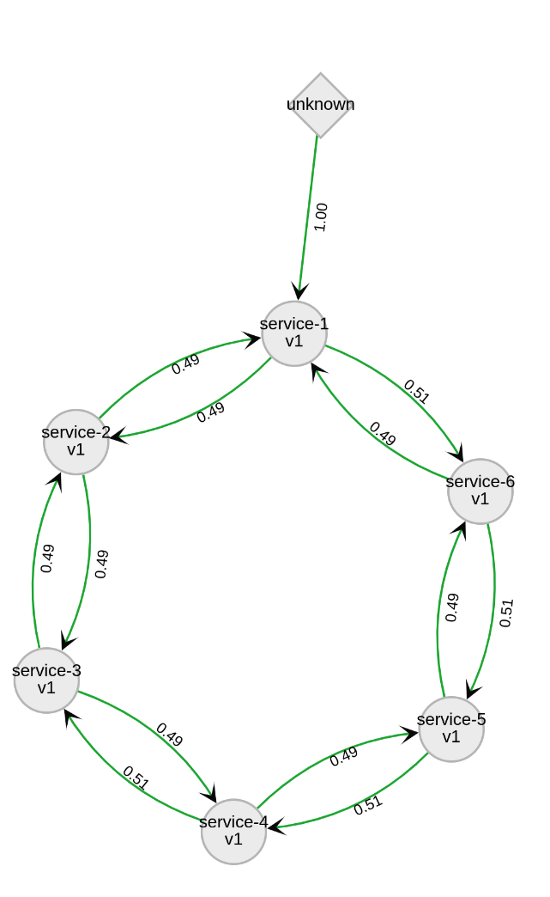
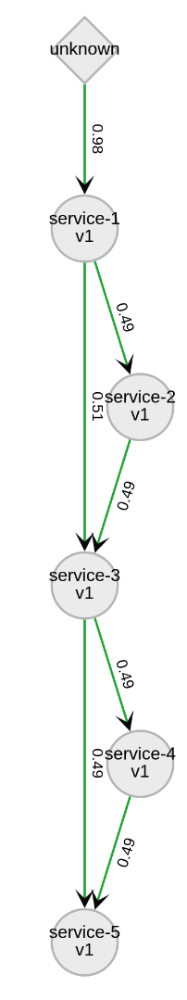
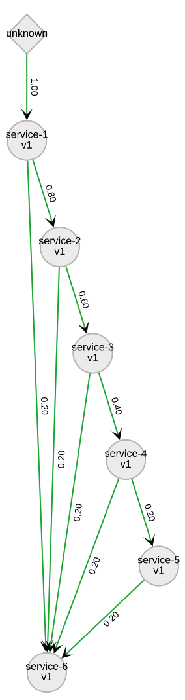

= Kiali Test Mesh Ansible Installer
:toc: macro
:toc-title:

toc::[]

== Dependecies
- Ansible 2.5+ (`sudo dnf install ansible`)
- Openshift Pip Module (`pip install openshift`)

== Introduction
Ansible installer for Kiali Test Mesh

A straightforward instalation command is

[source,shell]
----
ansible-playbook deploy_test_meshes.yml -e number_of_services=6 -e number_of_versions=1 -e number_of_apps=6 -e deployment_type='Deployment' -e '{"meshes": ["kiali-test-depth", "kiali-test-breadth", "kiali-test-circle", "kiali-test-circle-callback", "kiali-test-hourglass", "kiali-test-depth-sink", "kiali-test-breadth-sink"]}' -v
----
which

- `number_of_services` is the number of services will be deployed per namespace

- `number_of_versions` is the number of versions each service will have per namespace

- `meshes` specifies which mesh will be installed.

- `number_of_apps` is the number of apps each workload will match. The playbook will distribute equally through the services

- `deployment_type` is the type of Deployment on Openshift (it can be ReplicaSet or Deployment - deployment will be use in case this variable is not defined)

== Available Meshes

== Kiali Complex Test Mesh
This mesh crosses multiple namespaces, uses deployments and replicatsets, and includes both workloads and applications. It is meant to be used to see how Kiali handles more complex scenarios.

image::images/kiali-complex-test-mesh.png[]

=== Complex Mesh Components

- Namespace: kiali-test-frontend
  - Product Page (Service)
    - Productpage V1 (Deployment - App)(With Istio Sidecar)
  - Details (Service)
    - Details V1 (ReplicaSet - App)(With Istio Sidecar)

- Namespace: kiali-test-reviews
  - Reviews  (Service)
    - Reviews V1 (Deployment - App)(With Istio Sidecar)
    - Reviews V2 (ReplicaSet - App)(With Istio Sidecar)
    - Reviews V3 (Deployment - Separate Workload)(With Istio Sidecar)

- Namespace: kiali-test-ratings
  - Ratings (Service)
    - Ratings V1 (Deployment - App)(With Istio Sidecar)
    - Ratings V2 (Deployment - App)(With Istio Sidecar)
    - Ratings V3 (Deployment - App)(Without Istio Sidecar)
    - Ratings V4 (ReplicaSet - App)(Without Istio Sidecar)
    - Ratings V5 (StatefulSet - App)(With Istio Sidecar)
    - Ratings V6 (DaemonSet - App)(With Istio Sidecar)
    - Ratings V6 (ReplicationController - App)(With Istio Sidecar)

[NOTE]
Mesh images presented below are using one version per service. More versions per service can change how the graph will look like.

The images below are out of date with the more recent Kiali versions, but they still represent the overall layout of what the meshes should look like.

=== Kiali Test Depth
image::images//kiali-test-depth.png[]

=== Kiali Test Breadth
image::images//kiali-test-breadth.png[]

=== Kiali Test Circle
image::images//kiali-test-circle.png[]

=== Kiali Test Circle Callback

=== Kiali Test Circle Hourglass

=== Kiali Test Depth Sink

=== Kiali Test Breadth Sink
image::images/kiali-test-breadth-sink.png[]

= Kiali Test Mesh Multi-Namespace Ansible Installer

A straightforward instalation command is

[source,shell]
----
ansible-playbook deploy_test_multiple_namespaces_meshes.yml -e number_of_services=5 -e number_of_versions=2 -e number_of_namespaces=2 -e number_of_apps=6 -e deployment_type='Deployment' -e '{"meshes": ["kiali-test-depth", "kiali-test-breadth", "kiali-test-circle", "kiali-test-circle-callback", "kiali-test-hourglass", "kiali-test-depth-sink", "kiali-test-breadth-sink"]}' -v
----
which

- `number_of_services` is the number of services will be deployed per namespace

- `number_of_versions` is the number of versions each service will have per namespace

- `meshes` specifies which mesh will be installed.

- `number_of_namespaces` is the number max of namespaces. The playbook will distribute equally through the namespaces.

- `number_of_apps` is the number of apps each workload will match. The playbook will distribute equally through the services

- `deployment_type` is the type of Deployment on Openshift (it can be ReplicaSet or Deployment - deployment will be use in case this variable is not defined)
