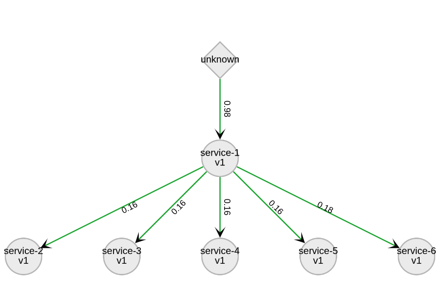

= Kiali Test Mesh Ansible Installer
:toc: macro
:toc-title:

toc::[]

== Dependecies
- Ansible 2.5+ (`sudo dnf install ansible`)
- Openshift Pip Module (`pip install openshift`)

== Introduction
Ansible installer for Kiali Test Mesh

A straightforward instalation command is

[source,shell]
----
ansible-playbook deploy_test_meshes.yml -e number_of_services=6 -e number_of_versions=1 -e '{"meshes": ["kiali-test-depth", "kiali-test-breadth", "kiali-test-circle", "kiali-test-circle-callback", "kiali-test-hourglass", "kiali-test-depth-sink", "kiali-test-breadth-sink"]}' -v
----
which

- `number_of_services` is the number of services will be deployed per namespace

- `number_of_versions` is the number of versions each service will have per namespace

- `meshes` specifies which mesh will be installed.

== Available Meshes
[NOTE]
Meshes presented on the following picture are using one version per service. More versions per service can  change how the graph will look like.

=== Kiali Test Depth
image::images//kiali-test-depth.png[]

=== Kiali Test Breadth

=== Kiali Test Circle
image::images//kiali-test-circle.png[]

=== Kiali Test Circle Callback
image::images//kiali-test-circle-callback.png[]

=== Kiali Test Circle Hourglass
image::images/kiali-test-hourglass.png[]

=== Kiali Test Depth Sink
image::images/kiali-test-depth-sink.png[]

=== Kiali Test Breadth Sink
image::images/kiali-test-breadth-sink.png[]

= Kiali Test Mesh Multi-Namespace Ansible Installer

A straightforward instalation command is

[source,shell]
----
ansible-playbook deploy_test_multiple_namespaces_meshes.yml -e number_of_services=5 -e number_of_versions=2 -e number_of_namespaces=2 -e '{"meshes": ["kiali-test-depth", "kiali-test-breadth", "kiali-test-circle", "kiali-test-circle-callback", "kiali-test-hourglass", "kiali-test-depth-sink", "kiali-test-breadth-sink"]}' -v
----
which

- `number_of_services` is the number of services will be deployed per namespace

- `number_of_versions` is the number of versions each service will have per namespace

- `meshes` specifies which mesh will be installed.

- `number_of_namespaces` is the number max of namespaces. The playbook will distribute equally through the namespaces.
